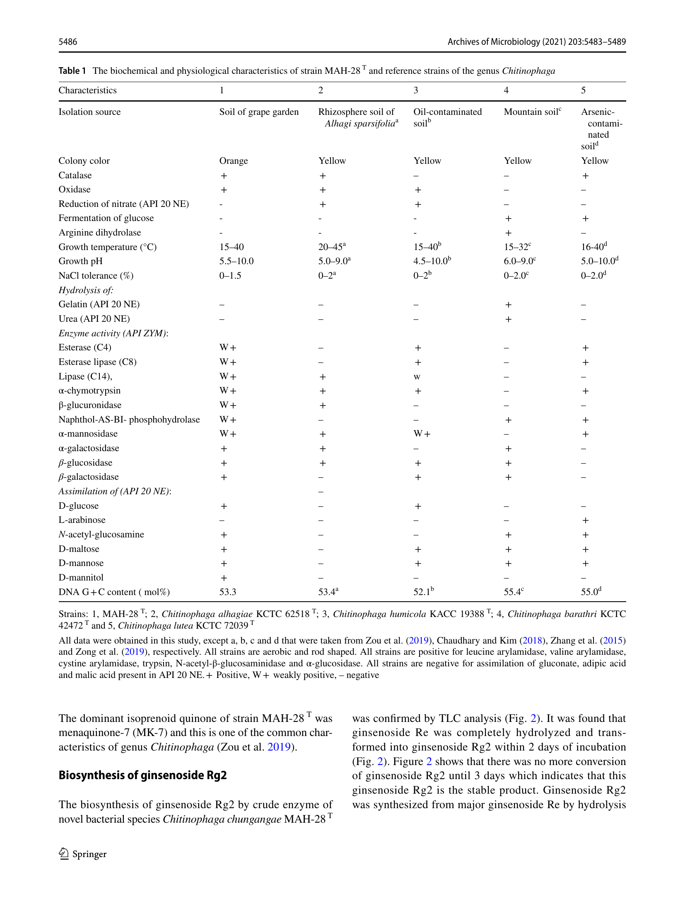
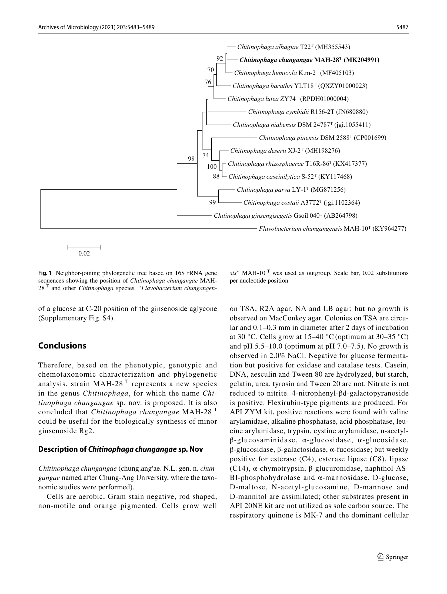
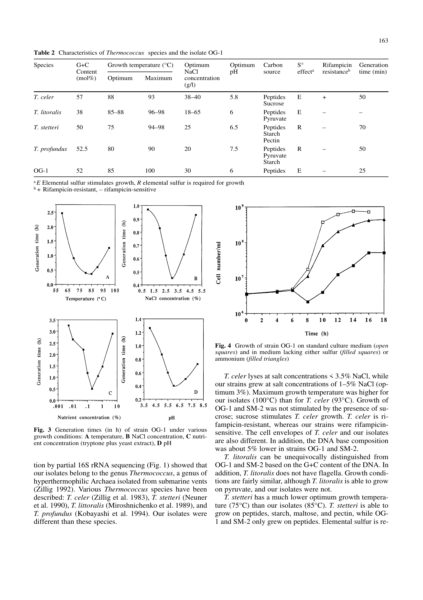
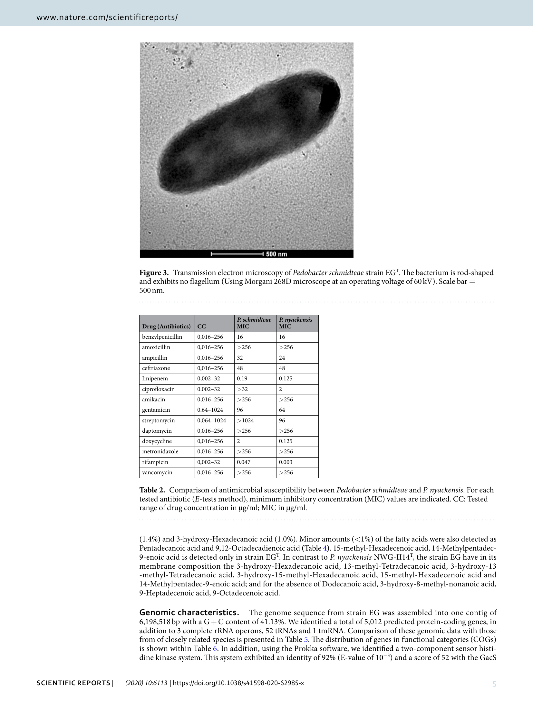
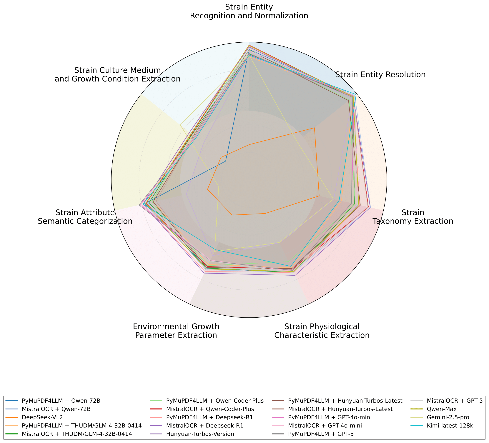
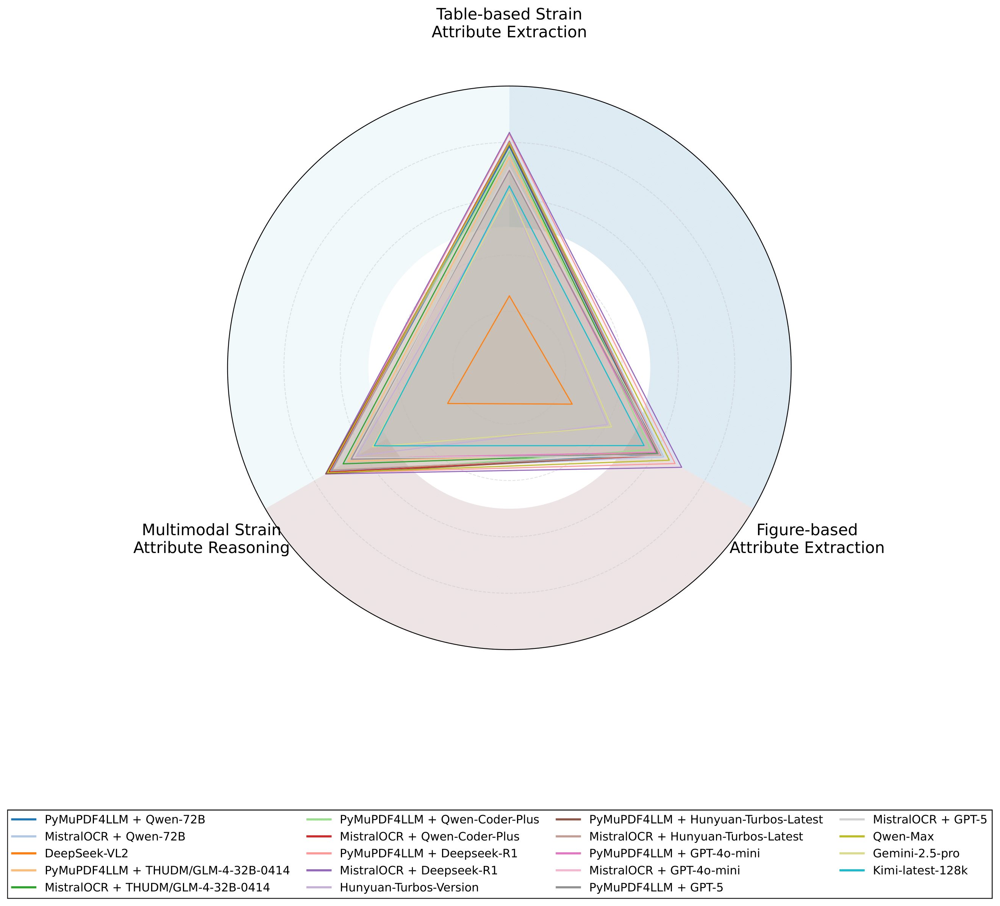
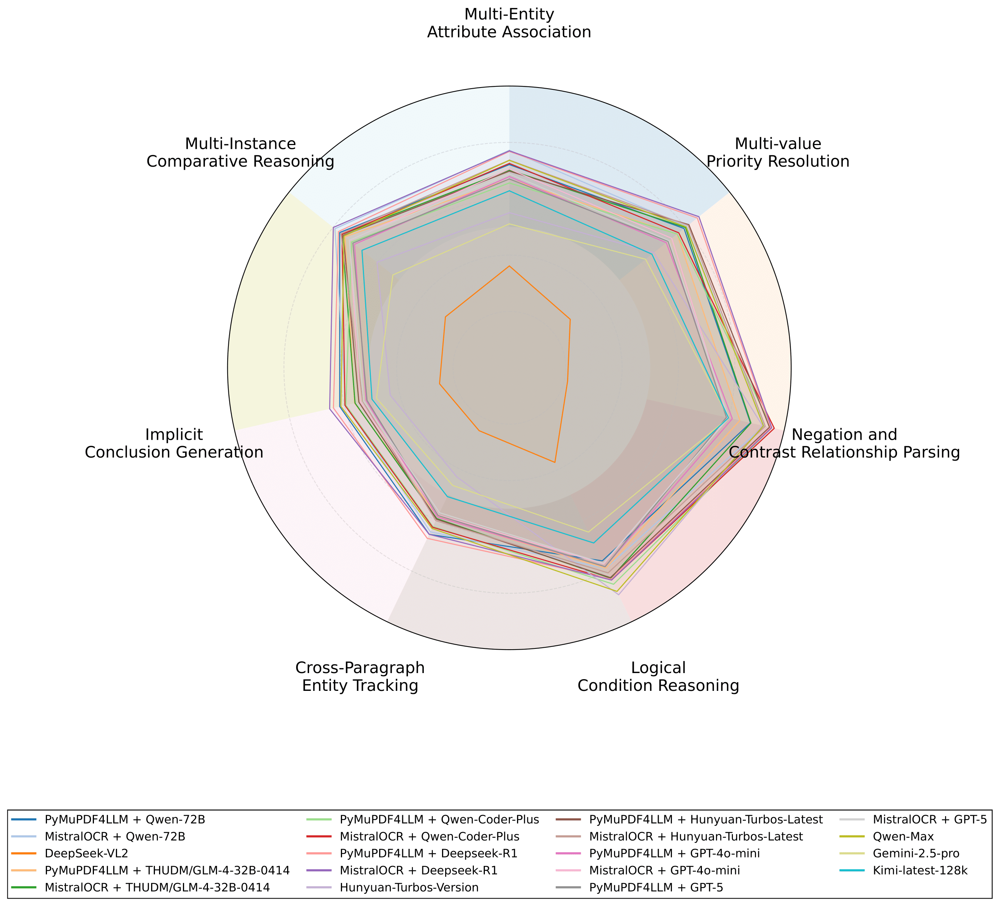
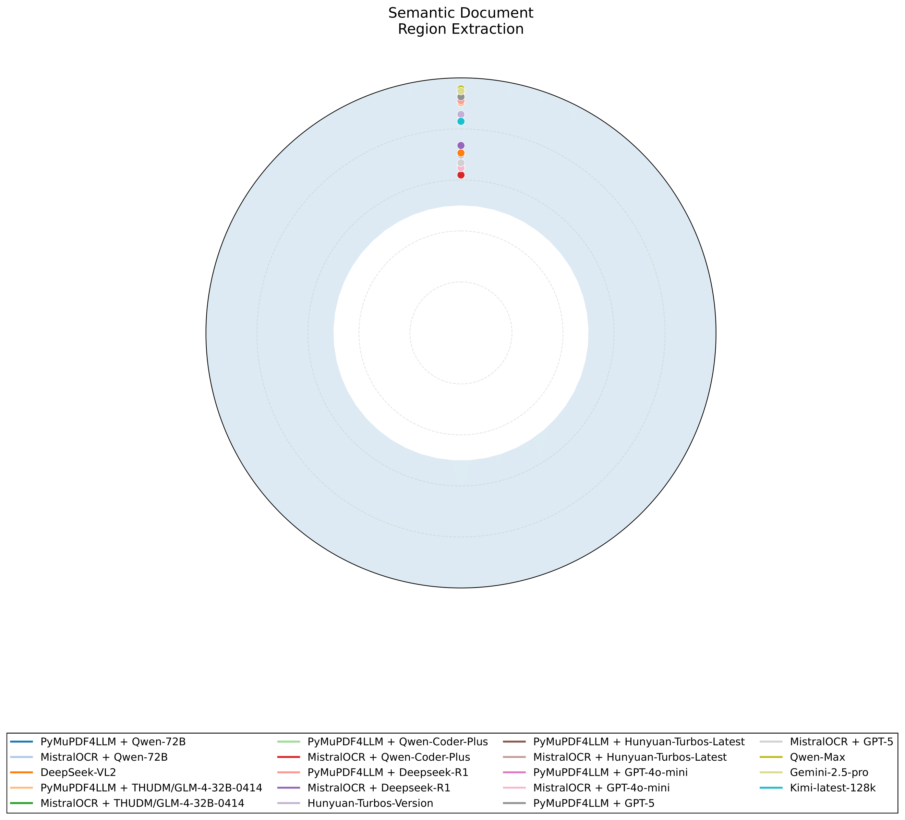

# MicrobeQuest

## 🧠 Introduction

**MicrobeQuest** is the **first comprehensive multimodal benchmark** tailored for microbiology-focused information retrieval and scientific document understanding.
It addresses a critical challenge in the domain: microbiological knowledge is scattered across **text, tables, figures, and complex document layouts**.

We curated **11, 877 expert-annotated multimodal query–response pairs** from real academic literature and public microbiology databases. MicrobeQuest systematically evaluates model performance across **18 real-world tasks**, covering structured extraction, multimodal reasoning, and layout-aware understanding.

---

## 🔄 Updates

* **May 2025** — Initial release of MicrobeQuest with **10,176** annotated multimodal query–response pairs
* **Dec 2025** — Expanded strain coverage and rebuilt benchmark to **11,877** annotated multimodal query–response pairs

---

## 📊 Task Types

MicrobeQuest tasks are grouped into four high-level categories:

### 1. **Structured Information Extraction**

* Strain Entity Recognition and Normalization
* Strain Entity Resolution
* Strain Taxonomy Extraction
* Strain Physiological Characteristic Extraction
* Environmental Growth Parameter Extraction
* Strain Attribute Semantic Categorization
* Culture Medium & Growth Condition Extraction

### 2. **Multimodal Reasoning**

* Table-based Attribute Extraction
* Figure-based Attribute Extraction
* Multimodal Attribute Reasoning

### 3. **Complex Semantic Reasoning**

* Multi-entity Attribute Association
* Multi-value Priority Resolution
* Negation & Contrast Interpretation
* Logical Condition Reasoning
* Cross-paragraph Entity Tracking
* Implicit Conclusion Generation
* Multi-instance Comparative Reasoning

### 4. **Layout Structure & Semantic Region Recognition**

* Semantic Document Region Extraction

---

## 📁 Benchmark Data Structure

All benchmark data are stored in `MicrobeQuest/benchmarks`, containing **18 JSON files**, each representing one of the NLP tasks.

Each multimodal test item contains:

- **A test question**
- **Chain-of-Thought guidance** for answer reasoning
- **Few-shot exemplars**
- **Expected answer type annotation**
- **Ground-truth answers**

---

## 🧪 Multimodal Example Cases

Here are some representative examples from **MicrobeQuest** to illustrate multimodal reasoning tasks involving **text, tables, and figures**.  
These examples are simplified views of full benchmark cases and are intended for qualitative illustration.

---


### Example 1: Multimodal Strain Attribute Reasoning

**Case ID:** MB-S019-3770  
**Task:** Multimodal Strain Attribute Reasoning  
**Difficulty:** Medium  

**Question:**  
> What is the maximum pH for growth for the strain MAH-28?

**Input:**  
- PDF segment: `S019`  
- Relevant table images:

<table>
  <tr>
    <td align="center">
      
    </td>
    <td align="center">
      
    </td>
  </tr>
</table>

**Few-shot Guidance:**  
- "What is the maximum pH for growth? Growth was detected in the pH range 5.0 to 9.2, with an optimum at pH 7.0." → `<Answer>9.2</Answer>`  
- "What is the maximum pH for growth? The strain can tolerate pH up to 8.5 under anaerobic conditions." → `<Answer>8.5</Answer>`  
- "What is the maximum pH for growth? Optimal pH is 6.8–7.4, with no other pH range provided." → `<Answer>not provided</Answer>`

**Expected Answer:**  
```xml
<Answer>10.0</Answer>
````

---

### Example 2: Table-based Strain Attribute Extraction

**Case ID:** MB-S092-233
**Task:** Table-based Strain Attribute Extraction
**Difficulty:** Easy

**Question:**

> What is the G+C content (mol%) for the strain OG-1?

**Input:**

* PDF segment: `S092`
* Relevant table image:

  

**Few-shot Guidance:**

* "What is the G+C content (mol%)? The genomic G+C content was 63.4%." → `<Answer>63.4</Answer>`
* "What is the G+C content (mol%)? G+C content ranged from 60–62%." → `<Answer>62.0</Answer>`
* "What is the G+C content (mol%)? Measured value: 65.1 ± 0.2 mol%." → `<Answer>65.1</Answer>`

**Expected Answer:**

```xml
<Answer>52</Answer>
```

---

### Example 3: Figure-based Attribute Extraction

**Case ID:** MB-S062-779
**Task:** Figure-based Attribute Extraction
**Difficulty:** Hard

**Question:**

> What is the shape for the strain EG?

**Input:**

* PDF segment: `S062`
* Relevant figure image:

  

**Few-shot Guidance:**

* "What is the shape? Cells are rod-shaped with slightly curved ends and sometimes appear coccoid under stress." → `<Answer>rod-shaped, slightly curved, coccoid</Answer>`
* "What is the shape? The organism exhibits a spiral shape and is highly motile." → `<Answer>spiral</Answer>`
* "What is the shape? No morphological data were given regarding the shape." → `<Answer>not provided</Answer>`

**Expected Answer:**

```xml
<Answer>rod-shaped</Answer>
```

---


## 🏆 Benchmark Results

We evaluated **19 state-of-the-art large language model systems**.
Key findings:

* **Miatral + DeepSeek-R1** achieves top performance in:

  * Structured information extraction
  * Multimodal reasoning
  * Complex semantic reasoning
* **Qwen-Max** leads in layout-aware tasks
* Although DeepSeek-R1 ranks first overall, **performance gaps with runner-up models are small** in many categories
* Tasks such as strain classification and multimodal reasoning remain **highly challenging and domain-sensitive**

---

## 📉 Mini-Leaderboard


| Model                                         | Overall F1 |
| --------------------------------------------- | ---------- |
| **M1 — PyMuPDF4LLM + Qwen-72B**               | **0.7478** |
| **M2 — MistralOCR + Qwen-72B**                | 0.7651     |
| **M3 — DeepSeek-VL2**                         | 0.3331     |
| **M4 — PyMuPDF4LLM + GLM-4-32B-0414**         | 0.7247     |
| **M5 — MistralOCR + GLM-4-32B-0414**          | 0.7349     |
| **M6 — PyMuPDF4LLM + Qwen-Coder-Plus**        | 0.7482     |
| **M7 — MistralOCR + Qwen-Coder-Plus**         | 0.7563     |
| **M8 — PyMuPDF4LLM + DeepSeek-R1**            | **0.7912** |
| **M9 — MistralOCR + DeepSeek-R1**             | **0.7920** |
| **M10 — Hunyuan-Turbos-Version**              | 0.6385     |
| **M11 — PyMuPDF4LLM + Hunyuan-Turbos-Latest** | 0.7563     |
| **M12 — MistralOCR + Hunyuan-Turbos-Latest**  | 0.7464     |
| **M13 — PyMuPDF4LLM + GPT-4o-mini**           | 0.7227     |
| **M14 — MistralOCR + GPT-4o-mini**            | 0.7161     |
| **M15 — PyMuPDF4LLM + GPT-5**                 | 0.7228     |
| **M16 — MistralOCR + GPT-5**                  | 0.7146     |
| **M17 — Qwen-Max**                            | 0.7787     |
| **M18 — Gemini-2.5-pro**                      | 0.5848     |
| **M19 — Kimi-latest-128k**                    | 0.6737     |

*Full task-wise metrics will be available on the online leaderboard.*

---

## 📈 Performance Chart


<p align="center">
  
  
</p>
<p align="center">
  
  
</p>

---

## 🚀 Quick Start

### 1. Installation

```bash
git clone https://github.com/acl-submission/MicrobeQuest.git
pip install -r requirements.txt
```

### 2. Download Source PDFs

Source PDFs cannot be redistributed due to copyright.
Download them manually (see `urls.json`) and place them in:

```
src/data/raw_pdfs/
```

You may also generate extracted images:

```bash
python pdf_downloader.py
```

### 3. Model Configuration

* **API-based models:** Edit `config.yaml` with your API keys
* **Local models:** Ensure models are deployed and update paths in config

### 4. Run Evaluation

```bash
python run_benchmark.py
```

---

## 📨 Supplementary Material
[Source Documents]([appendix/tables/source_documents.pdf](https://github.com/yulab-pku/MicrobeQuest/blob/main/resources/supplementaryMaterial.pdf))


## 📨 Contact


---

## 📚 Citation


---


